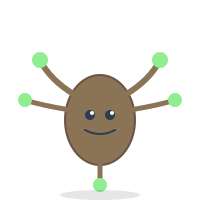

# Branchy Integration Guide

## Quick Start

### HTML Integration

```html
<!-- Basic usage -->


<!-- With state changes -->

<script>
  function updateBranchyState(state) {
    document.getElementById('branchy-status').src = `assets/branchy-${state}.svg`;
  }
</script>
```

### React Component

```jsx
import React, { useState } from 'react';

const Branchy = ({ state = 'base', size = 100, animated = true }) => {
  const [currentState, setCurrentState] = useState(state);
  
  const stateColors = {
    base: 'neutral',
    green: 'success',
    yellow: 'warning',
    red: 'error',
    blue: 'info'
  };
  
  return (
    <div className={`branchy-container ${animated ? 'animated' : ''}`}>
      
    </div>
  );
};

// Usage
<Branchy state="green" size={150} animated={true} />
```

### Vue Component

```vue
<template>
  <div :class="['branchy-wrapper', { animated }]">
    
    <span v-if="showLabel" class="branchy-label">
      {{ stateLabels[state] }}
    </span>
  </div>
</template>

<script>
export default {
  props: {
    state: {
      type: String,
      default: 'base',
      validator: (value) => ['base', 'green', 'yellow', 'red', 'blue'].includes(value)
    },
    size: {
      type: Number,
      default: 100
    },
    animated: {
      type: Boolean,
      default: true
    },
    showLabel: {
      type: Boolean,
      default: false
    }
  },
  data() {
    return {
      stateLabels: {
        base: 'Ready',
        green: 'Active',
        yellow: 'Warning',
        red: 'Error',
        blue: 'Focused'
      }
    };
  }
};
</script>
```

## Advanced Usage

### Status Dashboard Component

```jsx
import React from 'react';

const SubdomainDashboard = ({ subdomains }) => {
  const getStateFromStatus = (status) => {
    const statusMap = {
      'active': 'green',
      'pending': 'yellow',
      'error': 'red',
      'maintenance': 'blue',
      'inactive': 'base'
    };
    return statusMap[status] || 'base';
  };
  
  return (
    <div className="subdomain-dashboard">
      {subdomains.map((subdomain) => (
        <div key={subdomain.id} className="subdomain-card">
          <Branchy 
            state={getStateFromStatus(subdomain.status)} 
            size={80} 
          />
          <h3>{subdomain.name}</h3>
          <p className="subdomain-url">{subdomain.url}</p>
          <span className={`status-badge ${subdomain.status}`}>
            {subdomain.status}
          </span>
        </div>
      ))}
    </div>
  );
};
```

### Animated State Transitions

```jsx
import React, { useState, useEffect } from 'react';
import { motion } from 'framer-motion';

const AnimatedBranchy = ({ state, onStateChange }) => {
  const [displayState, setDisplayState] = useState(state);
  
  useEffect(() => {
    // Animate transition
    setDisplayState(state);
    if (onStateChange) {
      onStateChange(state);
    }
  }, [state]);
  
  return (
    <motion.div
      initial={{ scale: 0.8, opacity: 0 }}
      animate={{ scale: 1, opacity: 1 }}
      transition={{ duration: 0.3 }}
      whileHover={{ scale: 1.1 }}
      whileTap={{ scale: 0.95 }}
    >
      
    </motion.div>
  );
};
```

### Loading Indicator

```jsx
const BranchyLoader = ({ message = "Loading subdomains..." }) => {
  const [frame, setFrame] = useState(0);
  const states = ['base', 'green', 'blue', 'base'];
  
  useEffect(() => {
    const interval = setInterval(() => {
      setFrame((prev) => (prev + 1) % states.length);
    }, 500);
    return () => clearInterval(interval);
  }, []);
  
  return (
    <div className="branchy-loader">
      <Branchy state={states[frame]} size={120} />
      <p>{message}</p>
    </div>
  );
};
```

### Connection Visualizer

```jsx
const BranchyNetwork = ({ domains, connections }) => {
  return (
    <svg width="800" height="600" className="branchy-network">
      {/* Draw connections */}
      {connections.map((conn, idx) => (
        <line
          key={idx}
          x1={domains[conn.from].x}
          y1={domains[conn.from].y}
          x2={domains[conn.to].x}
          y2={domains[conn.to].y}
          stroke="#3498DB"
          strokeWidth="2"
          className="connection-line"
        />
      ))}
      
      {/* Draw Branchy nodes */}
      {domains.map((domain) => (
        <foreignObject
          key={domain.id}
          x={domain.x - 50}
          y={domain.y - 50}
          width="100"
          height="100"
        >
          <Branchy state={domain.state} size={100} />
        </foreignObject>
      ))}
    </svg>
  );
};
```

## CSS Styling

```css
.branchy-container {
  display: inline-block;
  position: relative;
}

.branchy-mascot {
  display: block;
  transition: transform 0.3s ease;
}

.branchy-container:hover .branchy-mascot {
  transform: scale(1.1);
}

.branchy-container.animated .branchy-mascot {
  animation: branchy-bounce 2s ease-in-out infinite;
}

@keyframes branchy-bounce {
  0%, 100% { transform: translateY(0); }
  50% { transform: translateY(-10px); }
}

/* State-specific styling */
.state-success { filter: drop-shadow(0 0 10px rgba(46, 204, 113, 0.5)); }
.state-warning { filter: drop-shadow(0 0 10px rgba(243, 156, 18, 0.5)); }
.state-error { filter: drop-shadow(0 0 10px rgba(231, 76, 60, 0.5)); }
.state-info { filter: drop-shadow(0 0 10px rgba(52, 152, 219, 0.5)); }

/* Dashboard grid */
.subdomain-dashboard {
  display: grid;
  grid-template-columns: repeat(auto-fill, minmax(200px, 1fr));
  gap: 20px;
  padding: 20px;
}

.subdomain-card {
  background: white;
  border-radius: 12px;
  padding: 20px;
  text-align: center;
  box-shadow: 0 2px 8px rgba(0,0,0,0.1);
  transition: transform 0.2s;
}

.subdomain-card:hover {
  transform: translateY(-5px);
  box-shadow: 0 4px 16px rgba(0,0,0,0.15);
}

/* Status badges */
.status-badge {
  display: inline-block;
  padding: 4px 12px;
  border-radius: 12px;
  font-size: 0.8em;
  font-weight: bold;
  margin-top: 8px;
}

.status-badge.active { background: #2ECC71; color: white; }
.status-badge.pending { background: #F39C12; color: white; }
.status-badge.error { background: #E74C3C; color: white; }
.status-badge.maintenance { background: #3498DB; color: white; }
.status-badge.inactive { background: #95a5a6; color: white; }
```

## API Integration Examples

### Fetching Subdomain Status

```javascript
async function updateBranchyStates() {
  try {
    const response = await fetch('/api/subdomains/status');
    const subdomains = await response.json();
    
    subdomains.forEach(subdomain => {
      const branchyElement = document.getElementById(`branchy-${subdomain.id}`);
      const state = mapStatusToState(subdomain.status);
      branchyElement.src = `/assets/branchy-${state}.svg`;
    });
  } catch (error) {
    console.error('Failed to update Branchy states:', error);
  }
}

function mapStatusToState(status) {
  const mapping = {
    'healthy': 'green',
    'degraded': 'yellow',
    'down': 'red',
    'processing': 'blue',
    'unknown': 'base'
  };
  return mapping[status] || 'base';
}

// Poll every 30 seconds
setInterval(updateBranchyStates, 30000);
```

### Real-time Updates with WebSocket

```javascript
const ws = new WebSocket('wss://api.cubiqo.ai/subdomains/stream');

ws.onmessage = (event) => {
  const update = JSON.parse(event.data);
  
  if (update.type === 'status_change') {
    const branchy = document.getElementById(`branchy-${update.subdomain_id}`);
    const newState = mapStatusToState(update.status);
    
    // Animate transition
    branchy.classList.add('state-transition');
    setTimeout(() => {
      branchy.src = `/assets/branchy-${newState}.svg`;
      branchy.classList.remove('state-transition');
    }, 300);
  }
};
```

## Accessibility

```jsx
const AccessibleBranchy = ({ state, label, description }) => {
  return (
    <div role="img" aria-label={label || `Subdomain status: ${state}`}>
      
      {description && (
        <span className="sr-only">{description}</span>
      )}
    </div>
  );
};
```

## Performance Optimization

```javascript
// Lazy loading for many Branchies
const LazyBranchy = ({ state, ...props }) => {
  return (
    
  );
};

// Preload critical states
const preloadBranchyStates = () => {
  const states = ['green', 'yellow', 'red'];
  states.forEach(state => {
    const link = document.createElement('link');
    link.rel = 'preload';
    link.as = 'image';
    link.href = `/assets/branchy-${state}.svg`;
    document.head.appendChild(link);
  });
};
```

## Testing

```javascript
import { render, screen } from '@testing-library/react';
import Branchy from './Branchy';

describe('Branchy Component', () => {
  it('renders with correct state', () => {
    render(<Branchy state="green" />);
    const img = screen.getByAlt(/branchy green/i);
    expect(img).toBeInTheDocument();
    expect(img).toHaveAttribute('src', '/assets/branchy-green.svg');
  });
  
  it('changes state when prop updates', () => {
    const { rerender } = render(<Branchy state="base" />);
    const img = screen.getByAlt(/branchy/i);
    
    rerender(<Branchy state="red" />);
    expect(img).toHaveAttribute('src', '/assets/branchy-red.svg');
  });
});
```

## Best Practices

1. **Always provide alt text** for accessibility
2. **Use appropriate sizes** - don't scale SVGs beyond their detail level
3. **Preload critical states** for faster transitions
4. **Batch state updates** to reduce re-renders
5. **Use CSS for simple animations** instead of JavaScript
6. **Consider dark mode** - Branchy works well on both light and dark backgrounds
7. **Test on mobile** - ensure touch targets are large enough
8. **Monitor performance** - use lazy loading for lists with many Branchies

## Troubleshooting

**Branchy not appearing:**
- Check file paths are correct
- Verify SVG files are accessible
- Check browser console for 404 errors

**Animations not working:**
- Ensure CSS is loaded
- Check browser supports SVG animations
- Verify no reduced-motion preference set

**State not updating:**
- Check state prop is changing
- Verify component is re-rendering
- Console log to debug state flow

---

**Questions?** Check the main design doc or reach out to the team!
